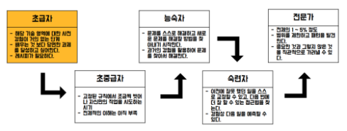
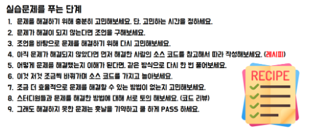

# 공부는 이렇게

## 1. 학습한 내용은 꼭 인터넷에 기록하자

### 1-1. 기록 > 기억
### 1-2. 정리하는 습관 만으로도 학습 효율이 올라간다.
### 1-3. 내가 나중에 찾아볼 수 있도록, 하드가 아닌 인터넷에 기록하자.

## 2. 소스 코드 위주로 공부하자

프로그래밍을 공부하는 것은 문제를 해결하기 위함이며, 문제를 해결하기 위해서는 프로그래밍 능력이 좋아야 한다.

이론은 나중에 배워도 괜찮다. 일단 정상적으로 돌아가게 만들고 나서, 왜 그렇게 되는지를 학습하는 것이 더 바람직하다.

## 3. 무엇을 모르는지 정확하게 설명하자.

어떤 부분을 모르는지 정확하게 아는 것이 중요하다. 조금 심하다고 느낄 정도로 모르는 부분을 정확히 정의하자.

예를 들어, Thread 강의 자료 중 네 번째 자료 중 일곱 번째 줄의 어떤 표현이 느낌이 이해가 안 되더라~ 와 같이.

어느 과목의 어느 챕터가 성취도가 부족한지를 정확히 파악해야 학습 효율이 좋다.

어디를 모르는지를 모르면 전체적인 자신감도 하락하며, 학습에 흥미를 잃게 된다.

## 4. 절대 한 번 수업으로 모든 것을 다 알 수 있을것이라는 착각을 버려야 합니다.

원래 오래 걸리는 일이다. 학습 속도가 느린 사람은 더 오래 걸리는 법이다.

한 번에 다 할 수 있을 것이라고 착각하지 말고, 여러 번 배울 계획을 세우는 것이 더 낫다.

## 5. 말로 표현하지 못하면 모르는 것이다.

아는 것과 안다고 착각하는 것을 구분하자. 팀 스터디의 가장 궁극적인 목표이기도 하다.

- 장점
    1. 말로 설명하다 보면 지식이 체계적으로 적립됨
    2. 더 잘 기억하도록 초반 학습부터 쳬계적으로 정리하도록 노력하며 학습하게 됨
    3. 아는 것과 모르는 것을 구분하여 모르는 것을 추가로 학습할 수 있게 됨
    4. 혼자 공부하는 것 보다 재미있음
    5. 기술 용어가 익숙해져 팀 협업 시 유리할 수 있음
    6. 취업을 희망하는 경우 기술면접에 대비할 수 있음
- [하브루타 영상(Youtube)](https://www.youtube.com/watch?v=nttlAfVQT6w)

## 6. 드라이퍼스 모델에 따른 초급자가 전문가로 되어가는 단계를 따른다.
철학자 드라이퍼스에 따르면 기술을 습득하는 데 5단계 과정을 거치게 된다.

- 드라이퍼스 모델

- 실습문제를 푸는 단계

## 7. 몰입하는 태도가 가장 중요하다.

- 몰입을 위한 방법
    1. 잘 하고 싶어 하는 마음 가짐
    2. 모든 일상을 지금 일에 집중하는 가치관을 수립하여 모든 행동의 기준 결정

- 몰입을 하지 못하는 상황의 경우
여건 상 몰입이 불가능 하기도 하다. 두 마리의 토끼를 잡는 것은 불가능하다. 무엇이 진정 나를 위하는 길인지 잘 판단하자.