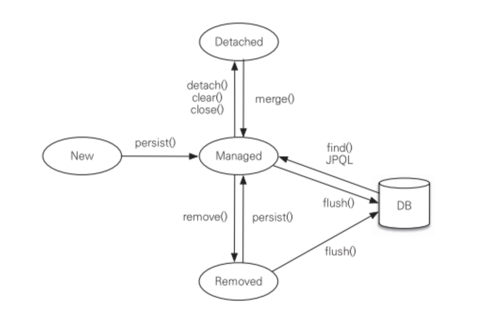

# Entity Life Cycle (엔티티의 생명주기)

## 1. Entity 의 생명 주기란?
Entity 는 DB 의 테이블 중 하나의 row 에 매핑되는 Java 객체이다. 이 객체는 JPA 를 사용하여 데이터베이스와 상호작용할 때 중요한 역할을 한다. 엔티티의 생명 주기는 엔티티가 생성되고, 관리되며, 삭제되는 과정을 설명한다.

## 2. Entity 의 생명 주기 단계
Entity 의 생명 주기 상태는 영속성 컨텍스트와 매우 깊은 연관이 있다. 영속성 컨텍스트에 의해 관리되면 상태가 자동으로 반영되고, 엔티티를 메모리에 캐시하여 데이터베이스에 대한 불필요한 조회를 줄이는 등 많은 변화가 생기게 된다.

이번 장에서는 가볍게 영속성 컨텍스트에 대해서는 다루지 않고, 영속성 컨텍스트와 어떤 관계를 맺는지에 대해서만 알아 보겠다.

### 2-1. Transient (일시적 상태)
영속성 컨텍스트에 저장되지 않은 상태이다.

### 2-2. Managed (관리 상태)
영속성 컨텍스트에 의해 관리되는 상태이다.

### 2-3. Detached (분리 상태)
영속성 컨텍스트에서 분리된 상태이다.

### 2-4. Removed (삭제 상태)
영속성 컨텍스트에서 제거된 상태이다.