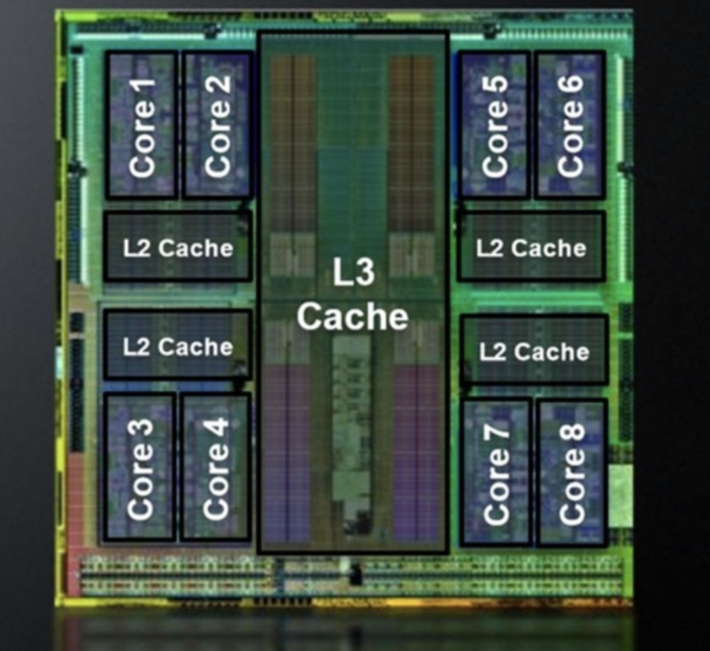

# Caching (캐싱)

## 1. 캐싱의 정의
캐싱은 자주 사용되는 데이터나 계산 결과를 임시로 저장하여, 데이터 접근 속도를 향상시키고 시스템 성능을 최적화하는 기술이다.

캐싱은 큰 범위에서 봤을 때 CPU 캐시와 메모리 캐시로 나뉘며, CPU 캐시는 CPU 내에 존재하는 캐시 메모리를 말하고, 메모리 캐시는 메모리 안에 있는 값을 말한다.

백엔드에서 일반적으로 말하는 캐시는 메모리 안에 있는 값을 말한다. 예를 들면, JPA 는 Dirty Check 이후 Entity 에 변경 사항이 없다면 DB 를 통하지 않고 바로 Persistence Context 내부에 있는 값을 메모리에서 빠르게 전달한다.

이번 장에서는 CPU 내에 존재하는 캐시 메모리에 대해서 간략하게 알아 보고, JPA 가 저장하는 캐시 메모리에 대해 자세하게 다룬다.

## 2. CPU 내에 존재하는 캐시 메모리
CPU 내의 캐시 메모리는 L1, L2, L3 캐시로 나뉜다. 이들은 CPU 의 성능을 극대화하기 위해 설계된 고속 메모리로, 자주 사용되는 데이터와 명령어를 저장하여 CPU 와 메모리 간의 데이터 전송 속도를 향상시킨다.

- L1 캐시 : 가장 빠르고, CPU 코어 내부에 위치하며, 매우 작은 용량을 가진다.
- L2 캐시 : L1 캐시보다 크고 느리지만, 여전히 CPU 내부에 있다.
- L3 캐시 : 여러 코어가 공유하는 캐시로, L2 보다 크고 느리며 CPU 와 메모리 사이에서 데이터 접근을 최적화한다.



### 2-1. L1 캐시
L1 캐시는 첫 번째 Level 의 캐시이다. CPU 코어 내부에 위치하며, 가장 빠른 캐시이다. 일반적으로 각각의 CPU 코어에 대해 별도의 L1 캐시가 존재한다.

용량은 16KB ~ 128KB 정도로 매우 작고, CPU 의 클럭 주기와 거의 동일한 속도로 동작한다고 한다.

저장되는 값의 예시에는 현재 실행 중인 프로그램의 명령어나 최근에 사용된 변수 값이나 계산 중간 결과 정도가 있다.

### 2-2. L2 캐시
L2 캐시는 L1 캐시보다 크고 느리지만 여전히 CPU 내부에 위치하는 두 번째 레벨의 캐시이다. L2 캐시는 L1 캐시와 함께 동작하여 데이터 접근의 효율성을 높인다.

용량은 256KB ~ 2MB 정도이며, L1 캐시보다는 느리지만 여전히 메모리보다 빠르다.

L2 캐시에는 L1 캐시에서 누락된 명령어를 보완하는 프로그램의 명령어를 저장한다. L1 캐시에 없는 데이터나 배열의 일부 요소나 객체의 속성을 저장하기도 한단다.

### 2-3. L3 캐시
L3 캐시는 여러 CPU 코어가 공유하는 캐시로, L2 캐시보다 더 큰 용량을 가지고 있다. 주로 멀티코어 프로세서에서 사용된다.

용량은 2MB ~ 수십 MB 까지 다양하며, L2, L3 캐시보다 느리지만 여전히 메모리보다 빠른 속도로 동작한다.

L3 캐시에는 여러 코어에서 공통적으로 사용하는 명령어나 큰 데이터 구조(행렬)나 자주 참조되는 데이터를 캐싱한다.

## 3. 주 기억 장치 (RAM) 내에 존재하는 캐시 메모리
주 기억 장치 (RAM) 내의 캐시는 일반적으로 RAM 과 CPU 사이에 있는 캐시를 의미한다. 이 캐시는 CPU 가 자주 사용하는 데이터와 명령어를 저장해서 메모리 접근의 지연을 줄이고, 데이터 전송 속도를 향상시킨다.

## 4. Redis 와 같은 외부 캐시 시스템
Redis 는 RAM 내에 캐시 메모리를 사용하는 것과 비슷한 효과를 제공하지만, 몇 가지 차이점이 있다.

우선, 둘 다 메모리 기반이기 때문에 데이터 접근 속도가 매우 빠르다.

그러나, Redis 는 여러 애플리케이션 서버 간에 데이터를 공유할 수 있고, 디스크에 영속적으로 저장할 수 있으며, 클러스트 모드를 통해 수평적 확장을 가능하다는 점에서 RAM 내에 캐시 메모리를 사용하는 것과 다르다.

백엔드의 관점에서, 레디스는 세션에 저장될 만한 정보를 저장하는 데에 사용하면 좋다. 서버의 세션에 정보를 저장하면 서버의 RAM 이 줄어 들지만, 외부 Redis 에 사용하면 서버의 RAM 대신 외부 Redis 서버의 RAM 이 줄어 들기 때문이다. 이를 통해 서버의 RAM 을 아낄 수 있다.

## 5. JPA 가 캐싱하는 메모리의 위치
JPA 는 1차 캐시와 2차 캐시라는 두 가지 수준의 캐시를 제공한다.

### 5-1. 1차 캐시
1차 캐시는 각 EntityManager 인스턴스에 내장되어 있으며, 해당 EntityManager 의 생명 주기 동안 유지된다. 메모리 내에 저장되기 때문에, 데이터베이스에 대한 접근을 최소화한다.

<예시>
> 1. Spring Data JPA 와 JPARepository 를 사용하는 백엔드 서버라고 가정.
> 2. JPARepository 를 통해 유저의 정보를 가져오는 로직을 수행한다고 가정.
> 3. Spring 의 EntityManager 는 해당 요청을 처리하기 위한 EntityManger 생성
> 4. 조회 요청이 들어오면, 영속성 컨텍스트(1차 캐시)에 User Entity 존재 확인
> 5. 존재하면 영속성 컨텍스트에서 가져 옴. 존재하지 않으면 DB 쿼리 통한 조회
> 6. 조회한 엔티티는 영속성 컨텍스트에 추가되어 다음 요청 시 재사용.

### 5-2. 2차 캐시
2차 캐시는 여러 EntityManager 인스턴스에서 공유되는 캐시로, 애플리케이션의 생명 주기 동안 유지된다. 2차 캐시는 외부 캐시 제공자를 사용하여 설정할 수 있으며, Redis, Encache, Hazelcast 등 다양한 캐시 솔루션을 사용할 수 있다.

## 6. JPA 가 캐싱하는 정보들
JPA 가 말하는 캐싱은, 메모리 안에 있는 Persistence Context 에 저장되어 있는 객체를 말한다.

## 7. JPA 가 캐싱하는 정보를 개발자가 컨트롤할 수 있을까?
개발자는 JPA 의 캐싱을 어느 정도 제어할 수 있다. 특히 2차 캐시와 관련해서는 설정을 통해 캐시를 활성화하거나 비활성화 할 수 있으며, 특정 엔티티에 대해 캐시 전략을 설정할 수 있다.

## 8. JPA 의 캐싱을 이용해서 더 빠른 응답을 만들려면 어떻게 해야 할까? (Java 코드 예시)

JPA 를 사용하여 2차 캐시를 활성화하는 방법이다. Hibernate 를 예로 들어 보자.

### Step 1. 2차 캐시 활성화
```xml
<persistence-unit name="yourPersistenceUnit">
    <properties>
        <!-- Hibernate 설정 -->
        <property name="hibernate.cache.use_second_level_cache" value="true"/>
        <property name="hibernate.cache.provider_class" value="org.hibernate.cache.ehcache.EhCacheRegionFactory"/>
        <property name="hibernate.cache.use_query_cache" value="true"/>
    </properties>
</persistence-unit>
```

### Step 2. 엔티티에 캐시 설정
캐시를 사용할 엔티티 클래스에 @Cacheable 애너테이션을 추가한다.
```java
import javax.persistence.*;
import org.hibernate.annotations.Cache;
import org.hibernate.annotations.CacheConcurrencyStrategy;

@Entity
@Cacheable
@Cache(usage = CacheConcurrencyStrategy.READ_WRITE) // 캐시 전략 설정
public class Product {
    @Id
    @GeneratedValue(strategy = GenerationType.IDENTITY)
    private Long id;

    private String name;
    private Double price;

    // Getters and Setters
}
```

### Step 3. 데이터 조회
이제 캐시를 이용하여 데이터를 조회하게 된다. 동일한 엔티티를 여러 번 조회할 경우, 2차 캐시를 통해 데이터베이스에 접근하지 않고 빠르게 응답할 수 있다.

다만 주의할 점이, @Cacheable 애너테이션은 Spring Framework 에서 제공하는 애너테이션이라는 것이다. 그러므로 @Cacheable 애너테이션을 사용했다면 Spring 서버의 메모리에 캐시된 데이터가 저장된다. (이 캐시는 JVM 의 힙 메모리 내에 존재하며, 애플리케이션이 종료되거나 캐시가 만료되기 전까지 유지된다.)

JPA 는 Persistence Context 에 저장되고, @Cacheable 애너테이션을 사용하면 JVM 의 힙 부분에 저장되며, 이 둘은 독립적이기 때문에 중복되어 저장될 수 있는 점에 조회하자.