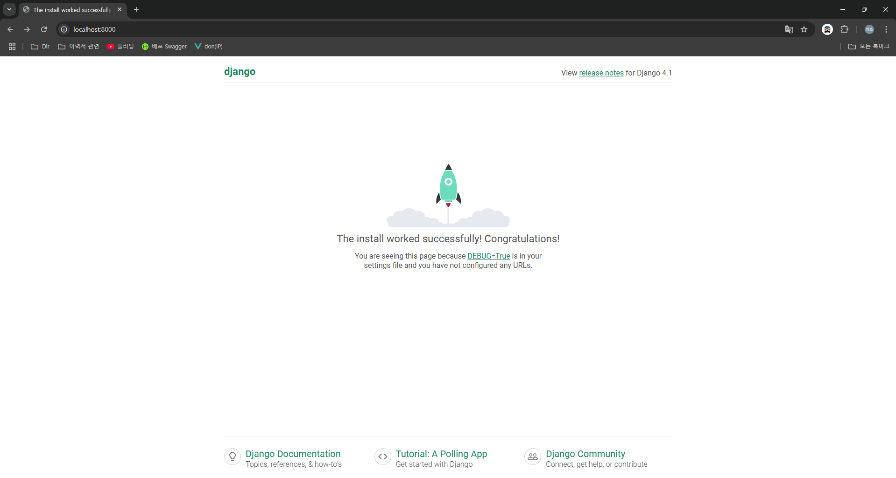

# Server Run

## 1. 장고의 개발 서버 특징
장고는 프로덕션 서버를 구성하기 위한 시간을 소비하지 않아도 코드를 빠르게 실행할 수 있는 경량 웹 서버와 함께 제공된다.

장고의 개발 서버를 실행하면 코드의 변경 사항을 지속적으로 확인해서 변경 사항이 자동으로 다시 로드되기 때문에 변경 후 수동으로 다시 로드할 필요가 없다. 그러나, 프로젝트에 새로운 파일을 추가하는 것과 같은 일부 작업을 인식하지 못할 수도 있기 때문에, 가능하면 수동으로 다시 시작하자.

## 2. 명령어
```bash
python manage.py runserver
```

