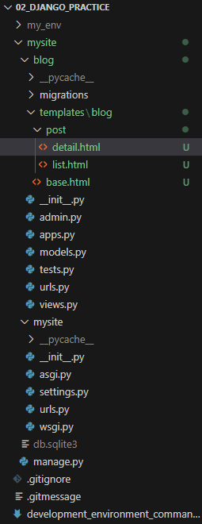

# Template

## 1. Template
URL 패턴은 URL 을 View 에 매핑하고 View 는 사용자에게 반환되는 데이터를 결정한다. 템플릿은 데이터가 표시되는 방식을 정의한다. 일반적으로 장고 템플릿 언어와 함께 HTML 로 작성된다.

애플리케이션에 템플릿을 추가하여 사용자에게 친숙한 방식으로 게시물을 표시해 보자.

템플릿 엔진은 디렉터리의 이름과 구조가 중요하다. 지금까지 만들었던 코드와 urls.py 의 설정에 따라 잘 커스터마이징 하도록 하자. 나는 아래와 같이 구성했다.


## 2. 템플릿 문법
- 템플릿 태그 : 템플릿의 렌더링을 제어하며  처럼 쓴다.
- 템플릿 변수 : 템플릿이 렌더링될 때 값으로 대체되며 {{ variable }} 처럼 쓴다.
- 템플릿 필터 : 표시할 변수를 수정하고 {{ variable|filter }} 와 같이 표시할 수 있다.

## 3. 코드
base.html
```html

<!DOCTYPE html>
<html>
<head>
  <title></title>
  <link href="" rel="stylesheet">
</head>
<body>
  <div id="content">
    
    
  </div>
  <div id="sidebar">
    <h2>My blog</h2>
    <p>This is my blog.</p>
  </div>
</body>
</html>
```

 은 INSTALL_APPS 설정에 포함된 django.contrib.staticfiles 애플리케이션에서 제공하는 정적 템플릿 태그를 로드한다. 로드한 이후, 이 템플릿 전체에서 { %static% } 템플릿 태그를 사용할 수 있다.

list.html
```html


My Blog


  <h1>My Blog</h1>
  
    <h2>
      <a href="">
        {{ post.title }}
      </a>
    </h2>
    <p class="date">
      Published {{ post.publish }} by {{ post.author }}
    </p>
    {{ post.body|truncatewords:30|linebreaks }}
  

```

 템플릿 태그를 사용하면 장고가 blog/base.html 템플릿을 상속받도록 지시할 수 있다. 그런 다음 기본 템플릿의 title 과 content 블록을 해당 콘텐츠로 채운다.

게시물들을 순회하면서 게시물들의 상세 페이지로 이동하기 위한 URL 링크를 포함한 title, date, author 그리고 body 를 표시한다. 여기서 링크의 URL 은 장고에서 제공하는 { %url% } 템플릿 태그를 사용하여 구성한다.

{ %url% } 태그를 사용하면 URL 을 이름을 가지고 동적으로 구성할 수 있다. blog 네임 스페이스에서 post_detail 의 URL 을 참조하기 위해서는 blog:post_detail 을 사용한다. 필수 매개 변수 post.id 를 전달해서 해당 게시물의 URL 을 작성한다.

게시물 body 에 두 가지 템플릿 필터를 적용한다. truncatewords 는 값을 지정된 단어 수로 자르고 linebreaks 는 출력을 HTML 줄 바꿈으로 변환한다.

JSP 같은 문법이라고 이해하면 좋을 듯하다.