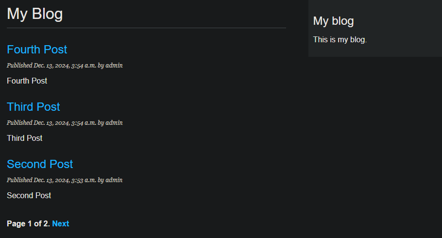

# Pagination

## 1. 페이징
한 페이지에 모든 게시물을 표시하는 대신 게시물 목록을 여러 페이지루 나누고 다른 페이지로 이동하는 링크를 추가할 수 있다. 이 기능을 페이징이라고 하며, 긴 목록을 표시하는 거의 모든 웹 애플리케이션에서 볼 수 있다.

무한 스크롤은 클라이언트의 요청 방식과 데이터 처리 방식이 다른 것 뿐이지, 서버 측에서 데이터를 반환하는 방식은 비슷하다.

## 2. 게시물 목록 View 에 Paging 추가하기
blog 애플리케이션의 views.py 파일을 편집해서 장고의 Paginator 클래스를 입포트하고 다음과 같이 post_list 뷰를 수정한다.

[views.py]
```python
from django.shortcuts import render, get_object_or_404
from .models import Post
from django.core.paginator import Paginator

def post_list(request):
    post_list = Post.published.all() # 커스텀 관리자
    # 페이지 당 세 개의 게시물로 페이지를 매김.
    paginator = Paginator(post_list, 3)
    page_number = request.GET.get('page', 1)
    posts = paginator.page(page_number)
    return render(request,
                  'blog/post/list.html',
                  {'posts': posts})

def post_detail(request, year, month, day, post):
    post = get_object_or_404(Post,
                            status=Post.Status.PUBLISHED,
                            slug=post,
                            publish__year=year,
                            publish__month=month,
                            publish__day=day)
    
    # get_object_or_404 메서드가 아닌 get() 메서드를 사용한 할 경우의 예외 처리
    # except Post.DoesNotExist:
    #     raise Http404("No Post found.")
    
    return render(request,
                  'blog/post/detail.html',
                  {'post': post})
```

위의 코드에서는 페이지 당 세 개의 게시물로 페이지를 매겼다.

## 3. 페이징 템플릿 만들기
사용자가 다른 페이지들을 조회할 수 있도록 페이지 네비게이션을 만들어야 한다. 페이지네이션과 관련된 HTML 코드를 추가하고, 이를 템플릿으로 만들어서 다른 곳에서 자유롭게 쓸 수 있도록 만들어 두자.

[pagination.html]
```html
<div class="pagination">
    <span class="step-links">
      
        <a href="?page={{ page.previous_page_number }}">Previous</a>
      
      <span class="current">
        Page {{ page.number }} of {{ page.paginator.num_pages }}.
      </span>
      
        <a href="?page={{ page.next_page_number }}">Next</a>
      
    </span>
</div>
```

이제 Post List 를 조회하는 HTML 코드에 페이지네이션 기능을 위한 템플릿을 포함시킨다.
[list.html]
```html


My Blog


  <h1>My Blog</h1>
  
    <h2>
      <a href="{{ post.get_absolute_url }}">
        {{ post.title }}
      </a>
    </h2>
    <p class="date">
      Published {{ post.publish }} by {{ post.author }}
    </p>
    {{ post.body|truncatewords:30|linebreaks }}
  
  

```


한 페이지에 최대 3개의 글이 들어갈 수 있고, 지금은 총 네 개의 글을 작성해서 페이지네이션이 원활하게 되는 모습이다.

## 4. 페이징 오류 처리하기
이제 View 에서 페이징 오류에 대한 예외 처리를 추가할 차례이다. 존재하지 않는 페이지 번호나 페이지 번호로 쓸 수 없는 문자열과 같이 잘못된 값으로 인해 오류가 발생할 수 있다. (ex_ localhost:8000/blog/page=3, 지금은 글의 개수가 6개를 넘지 못하기 때문)

Paginator 객체는 페이지 3을 조회할 때 범위를 벗어나기 때문에 EmptyPage 에러를 발생시킨다. 표시할 결과가 없다는 의미이다. View 에서 이 오류를 처리해 보자.

[views.py]
```python
from django.shortcuts import render, get_object_or_404
from .models import Post
from django.core.paginator import Paginator, EmptyPage, PageNotAnInteger

def post_list(request):
    post_list = Post.published.all() # 커스텀 관리자
    # 페이지 당 세 개의 게시물로 페이지를 매김.
    paginator = Paginator(post_list, 3)
    page_number = request.GET.get('page', 1)

    try:
        posts = paginator.page(page_number)
    
    except PageNotAnInteger: # page_number 가 정수가 아니라면
        posts = paginator.page(1) # 첫 페이지를 반환하자.
    
    except EmptyPage: # 페이지의 번호가 벗어나면
        posts = paginator.page(paginator.num_pages) # 마지막 페이지를 반환하자.

    return render(request,
                  'blog/post/list.html',
                  {'posts': posts})

def post_detail(request, year, month, day, post):
    post = get_object_or_404(Post,
                            status=Post.Status.PUBLISHED,
                            slug=post,
                            publish__year=year,
                            publish__month=month,
                            publish__day=day)
    
    # get_object_or_404 메서드가 아닌 get() 메서드를 사용한 할 경우의 예외 처리
    # except Post.DoesNotExist:
    #     raise Http404("No Post found.")
    
    return render(request,
                  'blog/post/detail.html',
                  {'post': post})
```
위와 같이 조치하여 정수가 들어오지 않을 경우, 범위를 벗어나는 값을 넣는 경우에 대하 예외 처리를 수행했다.