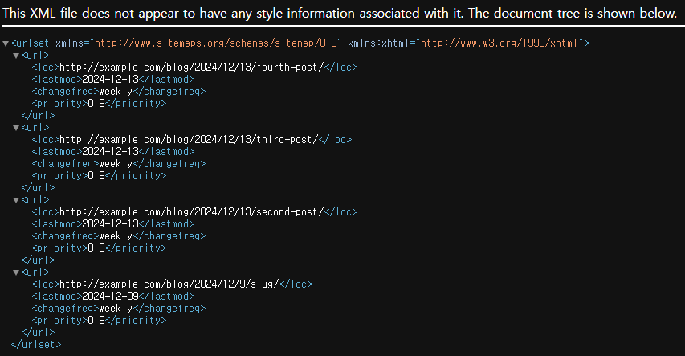

# Site Map

## 1. Site Map 이란?
Site Map(사이트 맵) 이란 웹사이트의 구조를 시각적으로 표현한 것이다. 웹 사이트의 모든 페이지와 그 페이지 간의 관계를 보여주며, 사용자와 검색 엔진 모두에게 유용하다.

사이트 맵은 HTML 사이트 맵과 XML 사이트 맵이 있다. HTML 페이지는 사용자가 웹사이트의 모든 페이지를 쉽게 찾을 수 있도록 링크를 제공하는 페이지이며, 보통 웹사이트의 하단에 위치한다.

XML 사이트 맵은 검색 엔진에 제출하기 위한 형식으로, 웹사이트의 모든 URL 과 메타데이터(업데이트 날짜, 중요도 등)를 포함한다. 주로 SEO(검색 엔진 최적화)를 목적으로 사용한다.

## 2. INSTALLED_APPS 설정에 추가
[settings.py]
```python
SITE_ID = 1

INSTALLED_APPS = [
    # ...
    'django.contrib.sites',
    'django.contrib.sitemaps',
]
```

## 3. 마이그레이션
```bash
python manage.py migrate
```

서드파티를 추가하는데 마이그레이션이 필요할까 싶겠지만, sites 애플리케이션을 추가하면 Site 라는 모델이 DB 에 추가된다고 한다.

## 4. sitemap 파일 만들기

[sitemaps.py]
```python
from django.contrib.sitemaps import Sitemap
from .models import Post

class PostSitemap(Sitemap):
    changefreq = 'weekly'
    priority = 0.9
    
    def items(self):
        return Post.published.all()
    
    def lastmod(self, obj):
        return obj.updated
```
sitempas 모듈의 Sitemap 클래스를 상속해서 커스텀 사이트맵을 정의했다.

## 5. urls.py 파일 편집
[urls.py]
```python
from django.contrib import admin
from django.urls import path, include
from django.contrib.sitemaps.views import sitemap
from blog.sitemaps import PostSitemap

sitemaps = {
    "posts": PostSitemap,
}

urlpatterns = [
    path("admin/", admin.site.urls),
    path("blog/", include("blog.urls", namespace="blog")),

    # 새로 추가
    path(
        "sitemap.xml",
        sitemap,
        {"sitemaps": sitemaps},
        name="django.contrib.sitemaps.views.sitemap",
    ),
]
```

이후 서버를 실행한다.
```bash
# server run
python manage.py runserver
```

http://localhost:8000/sitemap.xml 을 열면 모든 게시물을 포함한 XML 출력이 표시된다.

[사이트맵 XML]


여기에 있는 각 객체의 URL 은 get_absolute_url() 메서드를 호출해서 만들어진다. lastmode 속성은 지정한 대로 updated 날짜 필드에 해당하며, changfreq 와 priority 속성도 PostSitemap 클래스에서 가져온다.

## 6. 도메인 수정하기
```text
http://localhost:8000/admin/sites/site
```

위 사이트는 Django 의 관리자 인터페이스에서 사이트 관련 정보를 관리하는 페이지이다. 위 사이트에 접속하면 Django 프로젝트에 등록된 사이트들을 CRUD 할 수 있다.

기본적으로 example.com 이 들어 있지만, 딱히 별 효력이 있는 것은 아니다. 만약에 가비아에서 다른 도메인을 적용하고 싶을 때 위 주소로 들어가서 설정해 주면 된단다.