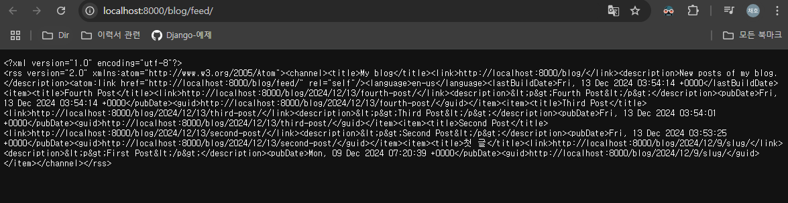

# Feed

## 1. Feed(피드) 란?
피드(Feed) 는 웹 사이트의 콘텐츠를 구조화해서 사용자에게 제공하는 형식이다. 일반적으로 XML 형식으로 작성되어, 기계가 읽고 처리할 수 있는 구조를 가지고 있다.

소셜 미디어 플랫폼에서 이야기하는 피드와 유사한 개념이긴 하지만, XML 형태로 제공되기 때문에 사람이 직접 읽기 위한 용도가 아니다. 대신, 피드는 RSS 리더와 같은 도구를 통해 사용자가 구독하고 최신 콘텐츠를 자동으로 받아볼 수 있게 돕는다.

- RSS: 웹 콘텐츠의 자동 배포를 위한 XML 형식의 피드.
- Atom: RSS와 유사한 구조의 XML 기반 피드 형식으로, 다양한 콘텐츠를 지원.
- Feed: 웹사이트의 구조화된 콘텐츠를 제공하는 형식으로, 주로 XML로 작성됨.
- Syndication: 콘텐츠를 여러 플랫폼에 배포하는 과정.

## 2. Syndication(신디케이션) 피드 프레임워크
인스타그램에 있는 피드는 정형화된 형태로 만들어졌기 때문에, 전용 Reader 가 있으면 하나의 형태로 일괄적으로 보이게 할 수 있다.

이번 장에서는 XML 형태인 Feed 로 정의해 보고, 그 다음에 RSS 전용 Reader 를 설치하여 인스타그램의 피드처럼 보이게 하는 것을 목표로 한다.

## 3. 피드 클래스 정의 및 urls.py 파일 수정
[feeds.py]
```python
import markdown

from django.contrib.syndication.views import Feed
from django.template.defaultfilters import truncatewords_html
from django.urls import reverse_lazy
from .models import Post

class LastestPostsFeed(Feed): # Feed 를 상속 받아서 정의함
    title = 'My blog'
    link = reverse_lazy('blog:post_list')
    description = 'New posts of my blog.'
    
    def items(self):
        return Post.published.all()
    
    def item_title(self, item):
        return super().item_title(item)
    
    def item_description(self, item):
        return truncatewords_html(markdown.markdown(item.body), 30)
    
    def item_pubdate(self, item):
        return item.publish
```

[urls.py]
```python
from django.urls import path
from . import views
from .feeds import LastestPostsFeed

app_name = "blog"
urlpatterns = [
    # post View
    path("", views.post_list, name="post_list"),
    # path("", views.PostListView.as_view(), name="post_list"),
    path(
        "<int:year>/<int:month>/<int:day>/<slug:post>/",
        views.post_detail,
        name="post_detail",
    ),
    path("<int:post_id>/share/", views.post_share, name="post_share"),
    path("<int:post_id>/comment/", views.post_comment, name="post_comment"),
    # 게시글을 태그 별로 나열하기 위해
    path("tag/<slug:tag_slug>/", views.post_list, name="post_list_by_tag"),
    path("feed/", LastestPostsFeed(), name="post_feed"),
]
```

## 4. Feed 조회
[localhost:8000/blog/feed -> urls.py 내에서 정의]
```xml
<?xml version="1.0" encoding="utf-8"?>
<rss version="2.0"
	xmlns:atom="http://www.w3.org/2005/Atom">
	<channel>
		<title>My blog</title>
		<link>http://localhost:8000/blog/</link>
		<description>New posts of my blog.</description>
		<atom:link href="http://localhost:8000/blog/feed/" rel="self"/>
		<language>en-us</language>
		<lastBuildDate>Fri, 13 Dec 2024 03:54:14 +0000</lastBuildDate>
		<item>
			<title>Fourth Post</title>
			<link>http://localhost:8000/blog/2024/12/13/fourth-post/</link>
			<description>&lt;p&gt;Fourth Post&lt;/p&gt;</description>
			<pubDate>Fri, 13 Dec 2024 03:54:14 +0000</pubDate>
			<guid>http://localhost:8000/blog/2024/12/13/fourth-post/</guid>
		</item>
		<item>
			<title>Third Post</title>
			<link>http://localhost:8000/blog/2024/12/13/third-post/</link>
			<description>&lt;p&gt;Third Post&lt;/p&gt;</description>
			<pubDate>Fri, 13 Dec 2024 03:54:01 +0000</pubDate>
			<guid>http://localhost:8000/blog/2024/12/13/third-post/</guid>
		</item>
		<item>
			<title>Second Post</title>
			<link>http://localhost:8000/blog/2024/12/13/second-post/</link>
			<description>&lt;p&gt;Second Post&lt;/p&gt;</description>
			<pubDate>Fri, 13 Dec 2024 03:53:25 +0000</pubDate>
			<guid>http://localhost:8000/blog/2024/12/13/second-post/</guid>
		</item>
		<item>
			<title>첫 글</title>
			<link>http://localhost:8000/blog/2024/12/9/slug/</link>
			<description>&lt;p&gt;First Post&lt;/p&gt;</description>
			<pubDate>Mon, 09 Dec 2024 07:20:39 +0000</pubDate>
			<guid>http://localhost:8000/blog/2024/12/9/slug/</guid>
		</item>
	</channel>
</rss>
```

가장 최근에 게시 된 다섯 개의 블로그 게시물을 포함한 RSS 피드가 표시된다. 이 XML 을 좀 더 예쁘게 보고 싶으면 RSS 피드 리더를 설치하면 조금 더 예쁘게 볼 수 있다. Fluent Reader 가 유명하다.

난 딱히 리더를 설치하지는 않아서 아래와 같이 보인다.
