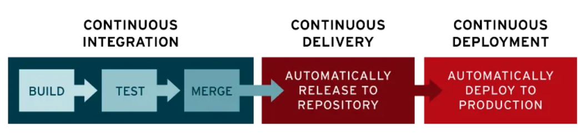

# CI/CD



## 1. CI/CD 란?
CI/CD 는 지속적 통합(Continous Integration)과 지속적 배포(Continous Development)의 약자로, 소프트웨어 개발 프로세스를 자동화하고 효율적으로 관리하기 위한 방법론이다.
- CI 는 개발자들이 코드 변경 사항을 자주 통합하고, 자동화된 테스트를 통해 품질을 보장하는 것을 목표로 하며,
- CD 는 이러한 통합된 코드를 자동으로 프로덕션 환경에 배포하는 과정을 의미한다.

## 2. CI/CD 를 해두면 좋은 점
구체적인 상황을 가정해 보자.
- Thymeleaf 를 사용하는 웹 프론트 서버
- 백엔드 서버를 배포해야 하는 상황을
- AWS(Cloud Service) 를 사용해서 특정 컴퓨터에 의존하지 않게 만드는 중.

보통 아래와 같은 절차를 밟는다.
```
1. Build (Gradle 을 이용해서 Compile -> Test -> Artifact 생성)
2. Artifact(.JAR) 파일 Cloud 환경으로 옮기기
3. Cloud 실행하기
```

CI/CD 를 통해서 파이프라인을 미리 만들어 두면,
위와 같은 과정을 Git 의 특정 브랜치에 push 하는 것만으로도 대체할 수 있다.

## 3. 파이프 라인이란 무엇인가?
파이프라인이란 소프트웨어 개발 주기의 모든 단계를 자동화하여 연속적으로 실행하는 흐름을 말한다.
일반적으로 CI/CD 에서 파이프라인이라고 하면, 개발 이후 배포까지의 흐름을 이야기한다.

> 다음은 CI/CD 과정에서 파이프라인의 과정을 순차적으로 나타낸 것이다.
```
- 소스 코드 관리 : 코드가 저장소에 푸시 될 때마다 파이프라인이 트리거된다.
- 빌드 (Build) : 소스 코드를 컴파일하고, 필요한 의존성을 설치하여 실행 가능한 애플리케이션을 생성한다.
- 테스트 (Test) : 자동화된 테스트를 실행하여 코드의 품질과 기능을 검증한다.
- 배포 (Deploy) : 테스트가 성공적으로 완료된 후, 애플리케이션을 프로덕트 환경에 배포한다.
- 모니터링 (Monitoring) : 배포 후 애플리케이션의 성능 및 오류를 모니터링하여 문제가 발생할 경우 신속하게 대응한다.
```

> 프로덕트 환경이란?
```
프로덕트 환경(Production Environment) 은 소프트웨어나 애플리케이션이 실제 사용자에게 제공되는 운영 환경을 의미한다.

"프로덕트 환경에 올린다" 라고 하면, 실제로 사용자가 접근하기 쉽게 사용할 수 있는 웹이나 PlayStore 에 올리는 상황을 생각하면 되겠다.
```

## 4. CI/CD 의 과정

## 5. GitAction 과 같은 CI/CD 툴은 뭘 해주는가

## 6. 그렇다면 내가 GitAction 에 주어야 할 정보는 뭐가 있을까?

## 7. CI/CD 와 관련하여 알아 두면 좋은 점들