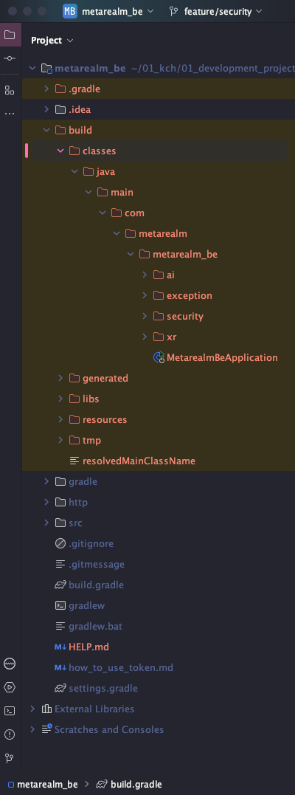

# Build

## 1. Build 란?
Build 는 소스 코드를 컴파일하고, 필요한 의존성을 결합하여 실행 가능한 형태의 소프트웨어 패키지를 생성하는 과정을 의미한다. 일반적으로 소프트웨어 개발에서 "빌드"는 코드가 최종 사용자에게 제공될 수 있는 형태로 변환되는 모든 단계를 포함한다.

## 2. Build 를 할 수 있는 도구
- Maven : Java 기반의 프로젝트 관리 및 빌드 도구로, XML 파일을 통해 프로젝트의 의존성, 빌드 과정 등을 정의한다.
- Gradle : Groovy(문법의 한 형태) 또는 Kotlin DSL 을 사용하여 빌드 스크립트를 작성하는 Java 기반의 빌드 도구로, 유연성과 성능이 뛰어나며, 대규모 프로젝트에서의 빌드 시간을 단축시킬 수 있다.
- npm : Node.js 프로젝트의 패키지 관리 및 빌드를 지원하는 도구이다. npm 은 JavaScript 패키지의 설치 및 관리를 쉽게 할 수 있도록 도와주며, 빌드 스크립트를 정의하고 실행할 수 있다.

## 3. Maven VS Gradle

### 3-1. Maven
- 구조화 : pom.xml 파일을 사용하여 프로젝트의 모든 설정을 정의한다. 구조가 엄격하기 때문에, 자연스럽게 표준화된 프로젝트 구조를 따른다.
- 의존성 관리 : 중앙 저장소에서 라이브러리를 검색하고 다운로드하여 의존성을 관리한다.
- 빌드 속도 : 대규모 프로젝트에서 빌드 속도가 느릴 수 있다. 모든 의존성을 매번 확인하고 다운로드 할 수 있다.

### 3-2. Gradle
- 유연성 : Groovy 또는 Kotlin DSL(문법) 을 사용하여 빌드 스크립트를 정의하여 직관적인 구성이 가능하다.
- 속도 : Incremental Build 를 지원하여 변경 사항만 빌드할 수 있어 빌드 속도가 빠르다.
- 의존성 관리 : Maven 중앙 저장소 뿐 아니라, 다양한 저장소를 통해 의존성을 관리할 수 있다.

### 3-3. 나만의 결론
취준생이긴 하지만 둘 다 써 본 입장에서 속도 차이가 많이 나지는 않았는데, 장기적으로 보면 Gradle 를 사용하는 게 더 좋은 것 같다. 유연성이나 속도가 대규모 프로젝트에서 특히 더 유리할 것 같다.

## 4. Build 도구가 빌드해주는 순서
Build 도구가 수행하는 일반적인 빌드 과정
```
1. 소스 코드 컴파일 : Java 파일(.java)을 바이트 코드(.class) 로 변환한다.
2. 의존성 다운로드 : pom.xml 또는 build.gradle 파일에 정의된 라이브러리를 중앙 저장소에서 다운로드한다.
3. 리소스 복사 : 필요한 리소스 파일(이미지, 설정 파일 등) 을 빌드 디렉터리로 복사한다.
4. 테스트 실행 : 단위 테스트 및 통합 테스트를 자동으로 실행하여 코드 품질을 검증한다.
5. 패키징 : 최종 애플리케이션을 JAR, WAR, Docker 이미지와 같은 형식으로 패키징한다.
6. 배포 : 생성된 패키지를 지정된 서버나 클라우드 환경에 배포한다.
```
- [Maven 중앙 저장소](https://repo.maven.apache.org/maven2)
- Gradle 은 기본적으로 Maven 중앙 저장소를 사용한다.

## 5. Build 도구가 없으면 어떻게 해야 할까?

JDK 설치 -> 프로젝트 디렉터리 구조 설정 -> Java 소스 코드 작성 -> Java 소스 코드 컴파일 -> 리소스 파일 복사 (필요한 경우) -> 클래스 파일 실행

실제 bash 명령어
```bash
# 1. JDK 설치 확인 (설치되어 있어야 함)

# 2. 프로젝트 디렉토리 생성
mkdir MyProject
cd MyProject
mkdir -p src/main/java
mkdir -p src/main/resources

# 3. Java 소스 코드 작성
echo "public class HelloWorld {
    public static void main(String[] args) {
        System.out.println(\"Hello, World!\");
    }
}" > src/main/java/HelloWorld.java

# 4. Java 소스 코드 컴파일
javac src/main/java/HelloWorld.java -d out

# 5. 리소스 파일 복사 (필요한 경우)
mkdir -p src/main/resources
echo "app.name=MyApp" > src/main/resources/config.properties

# 6. 클래스 파일 실행
java -cp out HelloWorld
```

## 6. Maven 이나 Gradle 는 어떻게 Spring 을 작동시킬까?
- 빌드 디렉터리는 빌드 도구가 build(Gradle) 라는 디렉터리를 생성한다.
- Gradle은 src/main/resources 디렉터리에 있는 리소스 파일들을 build/resources/main 디렉터리로 복사한다. 이 과정도 빌드 프로세스에 따라 자동으로 수행된다.

예시 디렉터리 구조
```
my-project/
├── build.gradle
└── src/
    ├── main/
    │   ├── java/
    │   └── resources/
    └── test/
        └── java/
```
빌드 후
```
my-project/
├── build.gradle
└── build/
    ├── classes/
    │   └── (컴파일된 클래스 파일)
    ├── resources/
    │   └── main/
    │       └── (복사된 리소스 파일)
    └── (기타 빌드 아티팩트)
```
실제 빌드 디렉터리



## 7. 그 외 Build 에 대해 알아야 할 것들
- CI/CD 통합 : 빌드 프로세스는 CI/CD 파이프라인의 중요한 부분이다. 빌드 도구를 사용하여 코드 변경 사항이 있을 때마다 자동으로 빌드 및 테스트를 수행할 수 있다.
- 빌드 환경 : 다양한 환경(예_ 개발, 테스트, 프로덕션)에 따라 빌드를 다르게 설정할 수 있다. 이를 통해 각 환경에 맞는 구성 파일과 의존성을 관리할 수 있다.
- 캐싱 : 빌드 도구는 이전 빌드의 결과를 캐시하여 빌드 시간을 단축시킬 수 있는 기능을 제공한다. 특히 대규모 프로젝트에서 유용하다.
- 서버리스 빌드 : 최근에는 클라우드 기반의 빌드 도구과 서비스가 증가하고 있으며, 이를 통해 로컬 환경이 아닌 클라우드에서 빌드를 수행할 수 있다.