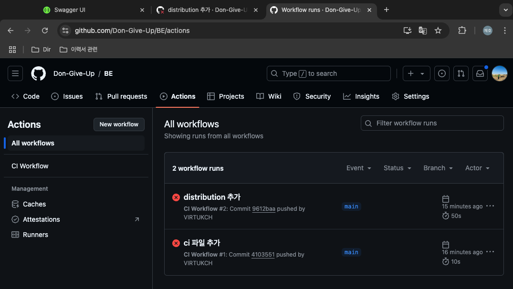

# GitHub Action Settings

## 1. GitHub Repository 준비
GitHub Action 은 GitHub 에 있는 레파지토리에 있는 소스 코드를 토대로 동작하기 때문에 일단 레파지토리가 있어야 한다. 레파지토리가 없다면 새로 생성하자.

## 2. .github/workflows 디렉터리 생성
로컬 프로젝트의 루트 디렉토리에 .github/workflows 폴더를 생성해야 한다. 이 폴더 내에 워크플로우 파일을 YAML 형식으로 생성한다. 예를 들어, ci.yml 이라는 이름의 파일을 생성할 수 있다.

## 3. 워크플로우 파일 작성
ci.yml 이라는 파일을 하나 만들었다고 하자. 기본 구조를 작성하면 된다.
```ci.yml
name: CI Workflow  # 워크플로우의 이름

on:
  push:  # 코드가 푸시될 때
    branches:
      - main  # 'main' 브랜치에 푸시될 때
      - dev    # 'dev' 브랜치에 푸시될 때
  pull_request:  # Pull Request가 생성될 때
    branches:
      - main  # 'main' 브랜치에 대한 PR
      - dev    # 'dev' 브랜치에 대한 PR

jobs:
  build:  # 'build'라는 이름의 잡 정의
    runs-on: ubuntu-latest  # Ubuntu 최신 버전에서 실행

    steps:  # 실행할 단계 목록
      - name: Checkout code  # 코드 체크아웃 단계
        uses: actions/checkout@v2  # GitHub Actions에서 제공하는 체크아웃 액션 사용

      - name: Set up JDK  # JDK 설정 단계
        uses: actions/setup-java@v2  # JDK 설정을 위한 액션 사용
        with:
          java-version: '17'  # 사용하고자 하는 Java 버전 설정

      - name: Build with Gradle  # Gradle 빌드 단계
        run: ./gradlew build  # Gradle 빌드 명령어 실행

      - name: Run tests  # 테스트 실행 단계
        run: ./gradlew test  # Gradle 테스트 명령어 실행
```

### 3-1. runs-on: ubuntu-latest
GitHub Actions 에서 호스팅 환경을 제공하는데, 그 환경을 우분투 환경으로 하겠다는 것이다.
- GitHub 는 Ubuntu, Windows, macOS 와 같은 다양한 운영 체제를 제공하는 가상 환경을 제공한다.
- ubuntu-lastest 는 현재 최신 버전의 Ubuntu 를 의미하며, GitHub 가 관리하는 이미지로 항상 업데이트 된다.
- 항상 ubuntu 를 써야 하는 것은 아니다. 그러나, macOS 나 Windows 로 하는 경우 명령어가 다르다.
- macOS 는 bash 명령어를, Windows 는 PowerShell 명령어를 입력해야 한다.

### 3-2. Checkout code
체크아웃(checkout)은 Git 버전 관리 시스템에서 특정 커밋이나 브랜치의 코드 상태를 디렉터리로 가져오는 과정이다.

### 3-3. Set up JDK
Set up JDK 단계는 JDK 를 설치하고 설정하는 과정이다.

### 3-4. Build with Gradle
```yaml
- name: Build with Gradle  # Gradle 빌드 단계
  run: ./gradlew build  # Gradle 빌드 명령어 실행
```

Gradle 을 사용해서 프로젝트를 빌드하는 과정이다. name 은 단계의 이름을 지정하는 것인데, run 은 실제로 Gradle 빌드 명령어를 실행하는 부분이다.

이 명령어는 실제로 Ubuntu 환경에서 Gradle을 사용하여 프로젝트를 빌드하는 과정이다.

### 3-5. Run tests
```yaml
- name: Run tests  # 테스트 실행 단계
  run: ./gradlew test  # Gradle 테스트 명령어 실행
```

이 단계는 Gradle 을 사용해서 프로젝트의 테스트를 실행하는 과정이다.

마찬가지로 이 명령어도 실제로 Ubuntu 환경에서 Gradle 을 사용하여 테스트를 수행한다.

## 4. GitHub Secrets 설정 (필요한 경우)
GitHub Action 은 Repository 에서 코드를 Checkout 해 오기 때문에 .gitignore 같은 파일에 추가된 중요한 정보는 GitHub Action 이 받을 수 없게 된다.

예를 들면, DB 의 URL 이나 USERNAME, PASSWORD 같은 정보들은 GitHub 에 올라가지는 않되, CI 를 수행할 때 작동하도록 해야 한다. 이러한 문제를 해결하기 위해 사용하는 것이 GitHub Secrets 설정이다.

GitHub Secrets 를 설정하는 방법에 대해서는 다음 파일에 이어서 다룬다.

## 5. 커밋 및 푸시

## 6. 워크플로우 실행 확인
해당 Repository 의 Actions 탭으로 이동하여 워크플로우가 정상적으로 잘 실행되는지 확인하자.
