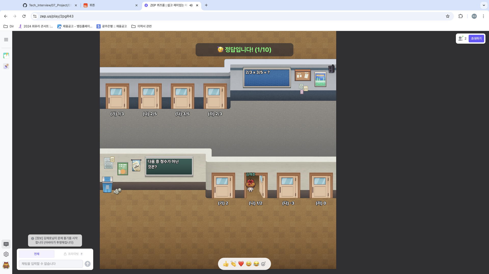
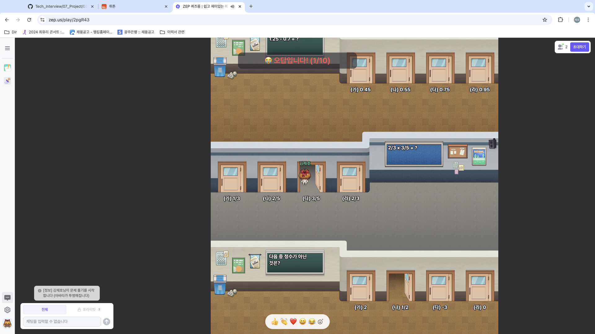

# 기획

## 1. 프로그램 개발 목적
- 대상 : 초등학생 5학년 ~ 사회 초년생
- 목적 : 경제가 순환하는 전반적인 과정을 이해하게 만들기 위함.
- 구성원 : 정부 / 가계 / 기업

```
[구성원 별 할 수 있는 행동]
- 정부 : 금리 조절, 세율 조절, 투표(민주주의 국가만), 유지 보수(도로 등)
- 가계 : 소비(상품 구매), 투자(건물 내고 월세 받기), 대출(은행 금리에 따른 동적인 영향)
- 기업 : 기업 추가, 상품 추가 (이 기업이나 상품에서 플랫폼 성향을 띠어야..)
```

```
[할 만한 컨텐츠]
- O / X 퀴즈로 추가적인 돈을 받을 수도 있음. (문제도 추가할 수 있도록 -> 플랫폼)
- 마지막에 정산한 돈을 가지고 옷을 살 수도 있음
```
- [참고할 만한 링크 1 -> zep 에서 하는 교육 위주의 퀴즈](https://zep.us/play/yVPoao)
- [참고할 만한 링크 2 -> zep 에서 하는 교육 위주의 퀴즈](https://zep.us/play/2bvnrj)
- 
- 

---

- 한계점 : 일회성 컨텐츠일 수 있다. 트래픽이 꾸준히 몰리지 않을 수 있음.

경제 순환에는 정부, 가계, 기업이 개입하며, 환율 그리고 수입 및 수출이 포함된다.

중점적으로 생산과 소비에 대해서 철저히 준비하는 것이 좋다고 생각함.

## 2. 꼭 지켜야 할 만한 규칙

### 2-1. 생산자와 소비자의 역할을 강제해야 한다.
생산자의 역할을 학생들에게 강제해야 한다. 주기적으로 월급을 받는 형태가 되었건, 판매한 매출에 비례해 수익을 얻는 형태가 되었건.

동시에, 소비자의 역할을 학생들에게 강제해야 한다. 포만감이 0이 되면 월급이나 순이익이 절반으로 주는 패널티를 주는 형태를 통해서, 아이들이 강제적으로 소비자의 역할을 수행할 수밖에 없게끔 만들어야 한다.

각 개인이 생산자와 소비자를 경험해 보면서, 경제의 한 사이클(수요와 공급 중심)을 경험하게 하는 것이 게임의 목적.

### 2-2. 기업을 만들고 싶은 경우, 기업명이나 판매 제품에 대한 적합성 검사를 AI 에 받아야 한다.
예를 들어, 기업의 이름에 욕설이나 비방이 들어가는 경우, AI 필터링에 의해 승인 받을 수 없다.

### 2-3. 

## 3. 프로그램 순환 과정

### 3-1. 시작과 종료가 있는가?
게임 형태로 시작할 수 있게 한다. 한 방에 모이지 않으면 게임을 시작할 수 없다. 또한, 선생님(관리자)이 없으면 게임을 시작할 수 없다.

선생님은 게임에서 생산자나 소비자의 역할은 할 수 없지만, 관리자로서 각 학생의 포만감을 실시간으로 조절한달지 등의 개입은 할 수 있다. (이유 없이 친구들에게 비방하는 경우, 선생님이 포만감을 줄인다덜지 or 월급을 뺏어 간달지.)

### 3-2. 시작 시점
최소 5인 이상이 한 방에 모여서 각자의 역할을 만들고 각 수행할 수 있는 역할이 적절한지를 판단한 다음, 

### 3-3. 중간 참가가 가능한가?
중간 참여를 하기 위해서는 해당 방을 찾고, 

### 3-3. 이벤트의 종류
### 3-4. 종료 시점
### 3-5. 시작과 종료가 없다면?

## 4. 백엔드가 할 일
- 로그인을 통해 각 사용자를 식별할 수 있다.
- 상점이 새로 생기거나, 상점에서 팔 만한 물건을 만들었을 경우, DB에 저장할 수 있도록 한다.
- 상점의 상호명이나 판매 제품 같은 것들이 적절한지 확인하기 위해, AI 와의 통신을 통해 적합성을 판단한다.
- 로그인 한 회원이 물풀을 구매하거나 포만감을 늘린 경우, 그 값을 저장하여 게임이 지속적으로 진행될 수 있도록 한다.
- 게임 이후 가장 돈을 많이 번 사람들의 랭킹을 관리한다. (명예의 전당)
- 게임이 종료되고 난 뒤에, 각 참여자의 채팅이 AI 에 전달됨. 이후, AI 는 채팅의 횟수 중 부적절한 채팅이 몇 번 있었는지 판별하고, 그 값을 다시 백엔드에 전달. 이후, 백엔드는 n회 이상 부적절한 채팅을 입력한 학생에 대해서 로그인이 불가능하게 만드는 등의 조치 가능 (교사는 차단을 풀 수 있음.)

## 5. 추가적인 기획

### 1. 환율 API

### 2. 두 국가 (금리 및 세율 조절 가능)
- 공산국가는 금리를 독재자 혼자서 결정할 수 있음
- 독재자는 나라 이동 못함

### 3. 