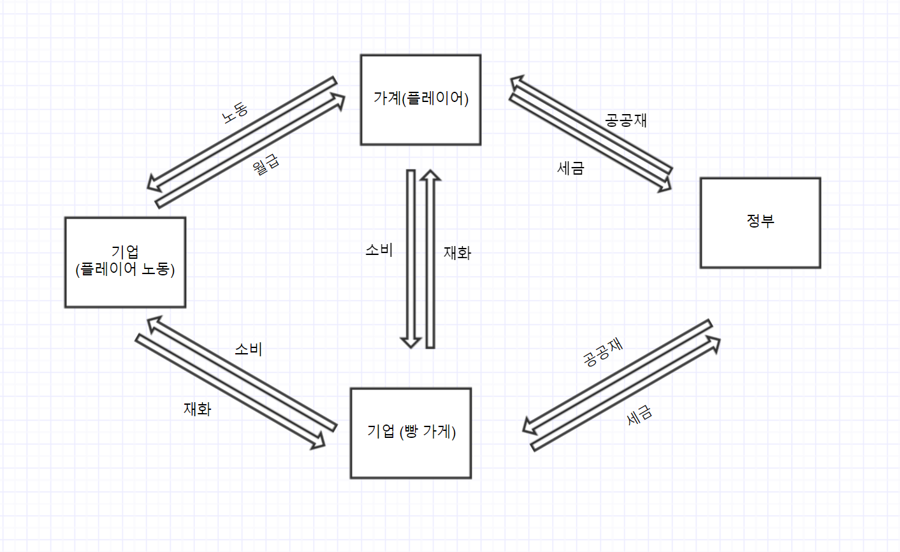

# 기획 다시하기

## 1. 대상
초등학교 6학년

## 2. 목적 및 의도
초등학교 6학년이 경제 구성원으로써 경제 순환에 대해 체험하게 하기 위함.


## 3. 우리 시스템이 돌아가는 원리

[플레이 시작 : (생산 -> 소비) -> (생산 -> 소비) -> 반복..]

### [1. 생산 => 생산과 소비를 포함한 시간은 15분이다.]

```
1. 사람이 월드에 들어 온다.

2. 사람은 밀 농장 직원이라는 명목으로 직업을 할당 받는다.

3. 일이란, 경제 관련 문제를 푸는 행위이다. 다섯 문제가 주어지며, 한 문제를 맞혔을 시, 한 문제 당 10만 원을 추가로 지급한다.

4. 시작은 월급일, 문제를 맞힌 것과 관계 없이 기본적으로 200만 원을 받을 수 있다. (세율은 10% 이다)
```

---

### [2-1. 소비 => 한 달의 시간은 게임에서 15분이며, 주가는 5분에 한 번씩 세 번 변동된다.]

```
1. 사람은 배고픔 때문에 한 달에 5개 의 빵을 필수적으로 사 먹어야 한다.

2. 빵의 가격은 하나에 15만 원이다. (변동 가능)

3. 남는 돈은 은행 저금 / 현금 보유 / 주식 투자 / 비 필수 상품에 소비할 수 있다.
```

---

### [2-2. 저축]

```
1. 은행은 대출 기능을 제공하지 않는다. 자유 적금만 가능하다. (매월 다른 금액을 저축할 수 있다)

2. 은행에서 정한 금리에 따라 원금 비례하여 이자를 받을 수 있다.

[Option]
- 금리의 조절
```

---

### [2-3. 투자]

```
1. 투자는 주식 투자만 가능하다.

2. 주식은 두 종목만 제공된다. (고위험 종목과 저위험 종목)

3. 주가는 5분 마다 변동 되며, 예측할 수 있는 정보가 즉시 제공된다. (전 주가에 대한 해설 정보도 같이 제공된다.)

[Option]
- 주가는 실제 주식의 가격으로 제공 되는가?
- 주가의 변동에 대한 타당한 근거를 주주에게 미리 제공할 것인가?
- 내부 요소로 주가가 변동되게 할 것인가? (빵의 판매량 등)
```

---

### [3. 새로운 한 달이 되었을 때 바뀔 수 있는 값들]
- 월급
- 물가
- 금리

[Option]
- 환율
- 실업률
- 국민 소득 (월급과 다른가?)