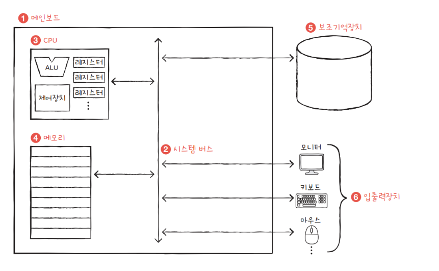
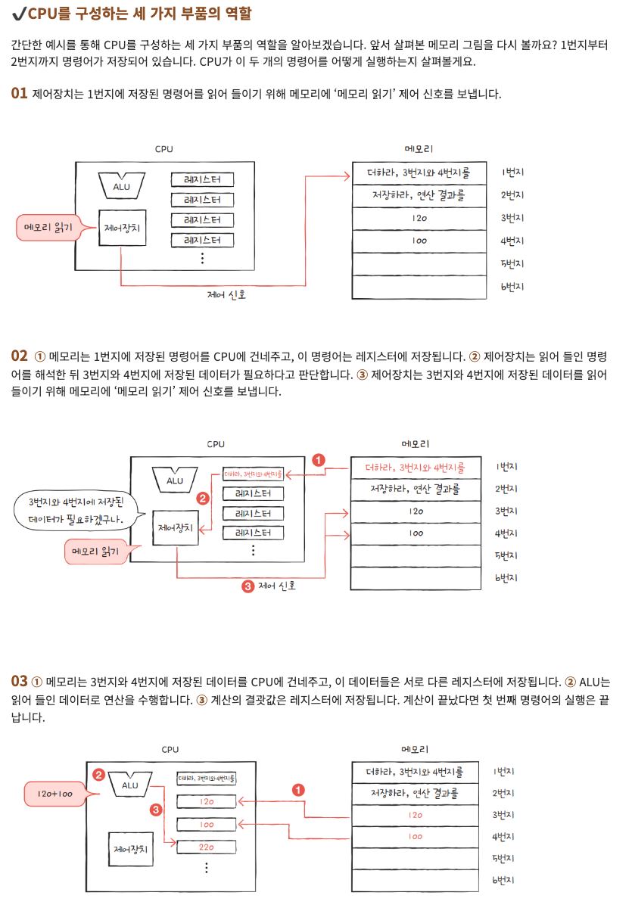

# Asynchronous

## CPU 란
CPU(Central Processing Unit)는 컴퓨터의 두뇌 역할을 하는 장치로, 명령어를 해석하고 실행하는 기능을 수행한다.

## CPU 의 구성
CPU는 크게 다음과 같은 구성 요소를 가진다.
- **연산 장치(ALU, Arithmetic Logic Unit)**: 산술 및 논리 연산을 수행한다.
- **제어 장치(Control Unit)**: 명령어를 해석하고 제어 신호를 생성한다.
- **레지스터(Register)**: 연산에 필요한 데이터를 저장하는 초고속 메모리이다.
- **캐시 메모리(Cache Memory)**: 자주 사용하는 데이터를 저장하여 속도를 높인다.

## CPU 의 동작 원리
CPU는 기본적으로 `명령어 사이클`을 반복한다.
1. **Fetch**: 메모리에서 명령어를 가져온다.
2. **Decode**: 명령어를 해석한다.
3. **Execute**: 연산을 수행한다.
4. **Writeback**: 결과를 저장한다.

## 코어란?
- 코어(Core)는 CPU 내부에서 독립적으로 연산을 수행할 수 있는 최소한의 연산 단위이다.
- 하나의 CPU는 여러 개의 코어를 가질 수 있으며, 이는 병렬 처리를 가능하게 한다.
- 구체적으로, 하나의 시점에 여러 개의 코어는 각각 독립적으로 작업을 처리할 수 있다.
- 그러나, "동시에 실행할 수 있는 작업을 처리하는 독립적인 실행 장치" 는 엄밀히 말하면 틀린 말이다.
- "코어는 독립적으로 연산을 수행할 수 있지만, 일부 자원(메모리, 버스 등)을 공유하는 실행 장치이다." 가 더 정확한 표현.
- 일반적으로 우리가 사용하는 CPU 는 4코어 ~ 8코어 정도 된다. (대표님 CPU 코어는 128코어)

## 쓰레드란?
- Thread 는 실행 가능한 작업의 단위이다.
- 하나의 코어는 하나 이상의 쓰레드를 실행할 수 있다. 다시 말하면, Thread 는 코어에 의해 실행된다.
- '프로그램'이 메모리에 로드되면 '프로세스' 라고 부를 수 있다.
- 프로세스는 여러 개의 Thread 로 표현될 수 있다.
- 하나의 프로세스 내에서 여러 개의 쓰레드가 동시에 병렬적으로 실행될 수도 있다. (각 쓰레드가 다른 코어 출신이라는 가정 하에)
- 같은 코어 출신의 쓰레드는 '동시에' 실행될 수는 없다. (한 시점을 잡았을 때, 같은 코어 출신의 쓰레드는 단 하나만 작업을 수행할 수 있다.)

## 서버에서의 쓰레드의 쓰임
- 하나의 Request 를 처리하기 위해서 각 Request 에 하나의 Thread 가 배정된다.
- Request 종료된 이후 완전히 버려지지 않고 재활용하기 위해 도입된 개념이 Thread Pool 이다.
- 백엔드 서버는 보통 멀티 쓰레드 서버이다.
- JavaScript는 기본적으로 싱글 쓰레드 기반이다.
- 하지만, Web API, 이벤트 루프(Event Loop) 등을 이용해 비동기 처리가 가능하다.
- 그래서 비동기 처리를 위해 CallBack, Promise, async/await과 같은 기법이 활용된다.
- 서버에서는 다수의 클라이언트 요청을 동시에 처리하기 위해 쓰레드를 활용한다.

## 비동기에 대한 결과를 받는 주체는 Thread 가 맞다.
- 예를 들어 데이터베이스 조회에 비동기를 도입한다고 해보자.
- 비동기라고 하더라도, 결국 Response 는 누군가 받아야 한다.
- 그러면 이 Response 는 누가 받을까?

- 결론부터 말하면, '응답을 받을 때 실제 실행하는 건 결국 쓰레드'다.
- 하지만, 그 쓰레드가 처음부터 끝까지 블로킹(대기)하는 건 아니다!

- 1️⃣ 비동기적으로 DB 조회 요청을 보냄.
- 2️⃣ OS 또는 이벤트 루프(Web API)가 "비동기 작업이 끝나면 다시 실행할 쓰레드"를 기억해둠.
- 3️⃣ 해당 쓰레드는 DB 응답을 기다리지 않고, 다른 작업을 수행하거나 쉬고 있음.
- 4️⃣ DB에서 응답이 오면, OS나 이벤트 루프가 쓰레드를 다시 깨워서 실행함.
- 5️⃣ 응답을 받아서 후처리를 실행하고 클라이언트에 Response를 보냄.

## 비동기란?
비동기(Asynchronous)란 요청을 보낸 후 응답을 기다리지 않고, 다른 작업을 수행할 수 있는 방식이다. 작업이 완료되면 콜백(callback)이나 Future, Promise 등을 통해 결과를 전달받는다.

## CallBack 이란?
- **콜백 함수(Callback Function)** 는 특정 작업이 완료된 후 실행되는 함수이다.
- 비동기 작업이 완료되었을 때 실행할 로직을 함수로 전달하는 방식이다.

## Promise 란?
- Promise 는 비동기 작업이 완료되었을 때 결과를 처리하는 객체이다.
- then, catch 메서드를 통해 성공 및 실패를 처리할 수 있다.

## Async/Await 란?
- async 함수 내부에서 await 키워드를 사용하여 비동기 작업을 동기적으로 작성할 수 있다.
- await 는 Promise가 해결될 때까지 기다린 후 결과를 반환한다.

## 내부 동작에서 쓰레드는 어떻게 반응하는가?
- JavaScript는 싱글 쓰레드(Single Thread) 환경에서 동작하지만, 비동기 처리를 위해 이벤트 루프(Event Loop)와 태스크 큐(Task Queue) 를 활용한다.
- 비동기 작업이 실행되면 Web API (브라우저 또는 Node.js 런타임)가 작업을 처리하고 완료되면 콜백을 태스크 큐에 등록한다.
- 이벤트 루프(Event Loop) 가 태스크 큐에서 콜백을 가져와 실행 가능할 때 메인 쓰레드에서 실행한다.

## 동기는 서버에서 어떻게 작용하는가
동기(Synchronous) 방식에서는 하나의 요청이 완료될 때까지 다음 요청을 수행하지 않는다.
- **Blocking I/O**: I/O 작업이 완료될 때까지 대기한다.
- **단순한 코드 흐름**: 처리 순서가 직관적이다.
- **리소스 점유율 증가**: 하나의 작업이 끝나기 전까지 다른 작업이 대기한다.

## 비동기는 서버에서 어떻게 작용하는가
비동기 방식에서는 요청을 보내고 즉시 다음 작업을 수행할 수 있다.
- **Non-blocking I/O**: 요청을 보낸 후 바로 다음 작업을 실행한다.
- **이벤트 기반(Event-driven) 구조**: 작업 완료 후 콜백을 통해 결과를 전달받는다.
- **높은 확장성**: 동시에 여러 요청을 처리할 수 있어 성능이 향상된다.

## 동기의 장점
- 코드의 흐름이 직관적이고 이해하기 쉽다.
- 디버깅이 용이하다.
- 복잡한 동기화 처리가 필요하지 않다.

## 동기의 활용 예시
- 데이터베이스 트랜잭션 처리
- 파일 시스템 작업(단일 사용자 환경)
- 간단한 CLI(Command Line Interface) 프로그램

## 비동기의 장점
- 하나의 쓰레드에서 여러 개의 작업을 동시에 처리할 수 있다.
- 서버의 응답성을 높일 수 있다.
- 네트워크 I/O, 파일 I/O 등의 작업에서 성능이 향상된다.

## 비동기의 활용 예시
- 웹 서버(예: Nginx, Node.js)
- 네트워크 요청 처리(예: 비동기 HTTP 요청)
- 대규모 이벤트 처리 시스템(예: Kafka, RabbitMQ)